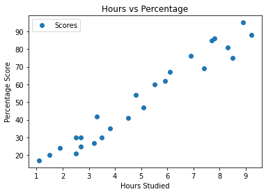
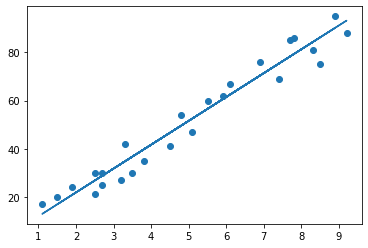

# The Sparks Foundation

## Task1: Prediction using Supervised ML
To Predict the percentage of marks of the students based on the number of hours they studied

### Author: Aashka Mohite


```python
#importing required libraries
import pandas as pd
import numpy as np
import matplotlib.pyplot as plt
from sklearn import linear_model
```


```python
#reading the data
url = "http://bit.ly/w-data"

df = pd.read_csv(url)
```


```python
df.head()
```


<div>
<style scoped>
    .dataframe tbody tr th:only-of-type {
        vertical-align: middle;
    }

    .dataframe tbody tr th {
        vertical-align: top;
    }

    .dataframe thead th {
        text-align: right;
    }
</style>
<table border="1" class="dataframe">
  <thead>
    <tr style="text-align: right;">
      <th></th>
      <th>Hours</th>
      <th>Scores</th>
    </tr>
  </thead>
  <tbody>
    <tr>
      <th>0</th>
      <td>2.5</td>
      <td>21</td>
    </tr>
    <tr>
      <th>1</th>
      <td>5.1</td>
      <td>47</td>
    </tr>
    <tr>
      <th>2</th>
      <td>3.2</td>
      <td>27</td>
    </tr>
    <tr>
      <th>3</th>
      <td>8.5</td>
      <td>75</td>
    </tr>
    <tr>
      <th>4</th>
      <td>3.5</td>
      <td>30</td>
    </tr>
  </tbody>
</table>
</div>


```python
df.shape
```


    (25, 2)


```python
df.describe()
```


<div>
<style scoped>
    .dataframe tbody tr th:only-of-type {
        vertical-align: middle;
    }

    .dataframe tbody tr th {
        vertical-align: top;
    }

    .dataframe thead th {
        text-align: right;
    }
</style>
<table border="1" class="dataframe">
  <thead>
    <tr style="text-align: right;">
      <th></th>
      <th>Hours</th>
      <th>Scores</th>
    </tr>
  </thead>
  <tbody>
    <tr>
      <th>count</th>
      <td>25.000000</td>
      <td>25.000000</td>
    </tr>
    <tr>
      <th>mean</th>
      <td>5.012000</td>
      <td>51.480000</td>
    </tr>
    <tr>
      <th>std</th>
      <td>2.525094</td>
      <td>25.286887</td>
    </tr>
    <tr>
      <th>min</th>
      <td>1.100000</td>
      <td>17.000000</td>
    </tr>
    <tr>
      <th>25%</th>
      <td>2.700000</td>
      <td>30.000000</td>
    </tr>
    <tr>
      <th>50%</th>
      <td>4.800000</td>
      <td>47.000000</td>
    </tr>
    <tr>
      <th>75%</th>
      <td>7.400000</td>
      <td>75.000000</td>
    </tr>
    <tr>
      <th>max</th>
      <td>9.200000</td>
      <td>95.000000</td>
    </tr>
  </tbody>
</table>
</div>


```python
# check if there are any null values or not
df.isnull().sum()
```


    Hours     0
    Scores    0
    dtype: int64


Here there are no null values in the dataset


```python
#visualizing the data
df.plot(x='Hours', y='Scores', style='o')  
plt.title('Hours vs Percentage')  
plt.xlabel('Hours Studied')  
plt.ylabel('Percentage Score')  
plt.show()
```


    

    


From the graph it can be observed that there is a positive linear relation between the number of hours studied and percentage score

### Preparing the data


```python
x = df.iloc[:,:-1].values
y = df.iloc[:,1].values
```


```python
from sklearn.model_selection import train_test_split  
x_train, x_test, y_train, y_test = train_test_split(x, y,test_size=0.2, random_state=0) 
```

### Training the algorithm


```python
regr = linear_model.LinearRegression()
regr.fit(x_train, y_train)

print("tarining successful")
```

    tarining successful
    


```python
line = regr.coef_*x+regr.intercept_

plt.scatter(x, y)
plt.plot(x, line);
plt.show()
```


    

    


### Making the prediction 


```python
y_pred = regr.predict(x_test)
prediction = pd.DataFrame({'Hours': [i[0] for i in x_test], 'Predicted Scores': [k for k in y_pred]})
prediction
```


<div>
<style scoped>
    .dataframe tbody tr th:only-of-type {
        vertical-align: middle;
    }

    .dataframe tbody tr th {
        vertical-align: top;
    }

    .dataframe thead th {
        text-align: right;
    }
</style>
<table border="1" class="dataframe">
  <thead>
    <tr style="text-align: right;">
      <th></th>
      <th>Hours</th>
      <th>Predicted Scores</th>
    </tr>
  </thead>
  <tbody>
    <tr>
      <th>0</th>
      <td>1.5</td>
      <td>16.884145</td>
    </tr>
    <tr>
      <th>1</th>
      <td>3.2</td>
      <td>33.732261</td>
    </tr>
    <tr>
      <th>2</th>
      <td>7.4</td>
      <td>75.357018</td>
    </tr>
    <tr>
      <th>3</th>
      <td>2.5</td>
      <td>26.794801</td>
    </tr>
    <tr>
      <th>4</th>
      <td>5.9</td>
      <td>60.491033</td>
    </tr>
  </tbody>
</table>
</div>


### Comparing the actual and predicted scores


```python
df = pd.DataFrame({"Actual":y_test, "predicted":y_pred})
df
```


<div>
<style scoped>
    .dataframe tbody tr th:only-of-type {
        vertical-align: middle;
    }

    .dataframe tbody tr th {
        vertical-align: top;
    }

    .dataframe thead th {
        text-align: right;
    }
</style>
<table border="1" class="dataframe">
  <thead>
    <tr style="text-align: right;">
      <th></th>
      <th>Actual</th>
      <th>predicted</th>
    </tr>
  </thead>
  <tbody>
    <tr>
      <th>0</th>
      <td>20</td>
      <td>16.884145</td>
    </tr>
    <tr>
      <th>1</th>
      <td>27</td>
      <td>33.732261</td>
    </tr>
    <tr>
      <th>2</th>
      <td>69</td>
      <td>75.357018</td>
    </tr>
    <tr>
      <th>3</th>
      <td>30</td>
      <td>26.794801</td>
    </tr>
    <tr>
      <th>4</th>
      <td>62</td>
      <td>60.491033</td>
    </tr>
  </tbody>
</table>
</div>


### Model evaluation 


```python
from sklearn import metrics
print('Mean Absolute Error:', metrics.mean_absolute_error(y_test, y_pred))
print('Mean Squared Error:', metrics.mean_squared_error(y_test, y_pred))
print('Root Mean Squared Error:', np.sqrt(metrics.mean_squared_error(y_test, y_pred)))
```

    Mean Absolute Error: 4.183859899002975
    Mean Squared Error: 21.5987693072174
    Root Mean Squared Error: 4.6474476121003665
    

### What will be predicted score if a student studies for 9.25 hrs/ day?


```python
hours = [[9.25]]
own_pred = regr.predict(hours)
print("No of Hours = {}".format(hours))
print("Predicted Score = {}".format(own_pred[0]))
```

    No of Hours = [[9.25]]
    Predicted Score = 93.69173248737538
    
